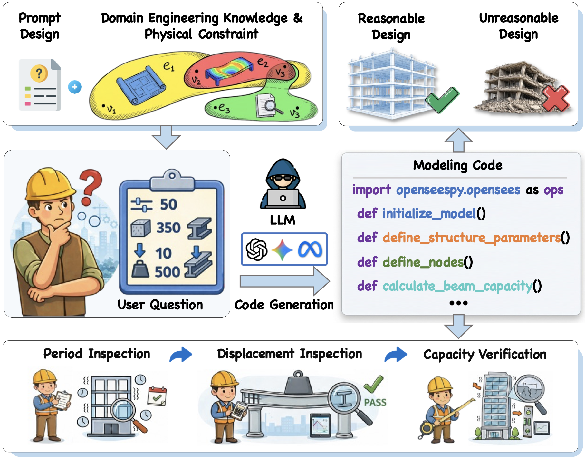
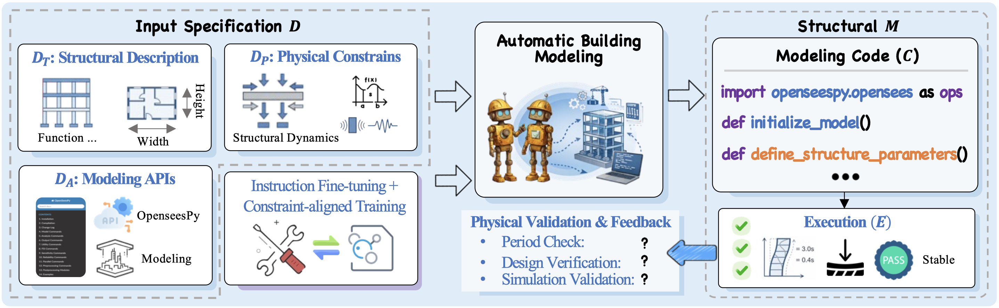
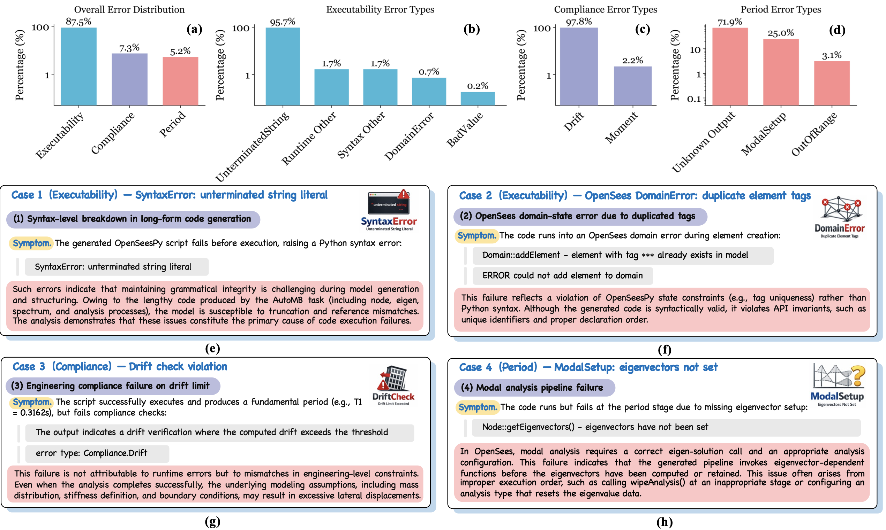
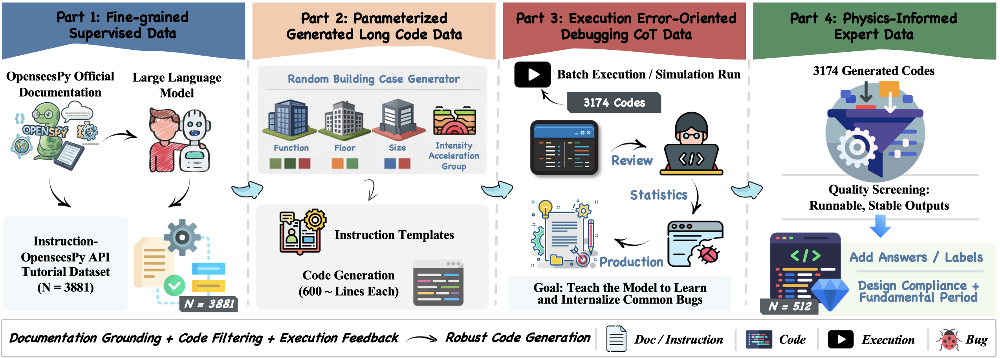

# AutoBM: Toward Physically Consistent and Simulation-Executable Programmatic Generation

<p align="center">
  <a href="https://arxiv.org/abs/2602.07083"></a>
  <a href="https://github.com/Jovanqing/AutoBM/blob/main/LICENSE"></a>
  <a href="https://huggingface.co/Jovanqing/Seed-Coder-8B-Reasoning-SFT"></a>
</p>

Official implementation of the paper:

> **Rethinking Scientific Modeling: Toward Physically Consistent and Simulation-Executable Programmatic Generation**
>
> Yongqing Jiang, Jianze Wang, Zhiqi Shen, Zhenghong Lin, Jiayuan Wang, Yijian Yang, Kaoshan Dai\*, Haoran Luo\*
>
> *arXiv preprint arXiv:2602.07083, 2026*

## Overview

**AutoBM** (Automatic Building Modeling) is a framework for generating executable, physically consistent structural modeling code from natural language specifications using LLMs. It addresses the challenge of ensuring that LLM-generated OpenSeesPy code not only compiles and runs, but also adheres to structural engineering constraints and produces physically valid simulation results.

<p align="center">
  
</p>
<p align="center"><b>Figure 1.</b> Task formulation of LLM-driven automatic building modeling from natural language descriptions. Given a user question with structural parameters, the LLM generates OpenSeesPy modeling code guided by domain engineering knowledge and physical constraints. The output undergoes multi-level verification — period inspection, displacement inspection, and capacity verification — to ensure physically consistent and simulation-executable results.</p>

### The AutoBM Task

<p align="center">
  
</p>
<p align="center"><b>Figure 2.</b> The definition and overview of the AutoBM task.</p>

### Limitations of AI-Generated Structural Modeling Code

<p align="center">
  
</p>
<p align="center"><b>Figure 3.</b> The limitations of AI-generated AutoBM task — an analysis based on 640 sets of modeling code generated by Gemini 2.5-Flash.</p>

### Key Contributions

- **AutoBM Task**: Formalizes automatic building modeling as a research task with clearly defined inputs (building specs) and outputs (executable, engineering-compliant structural modeling code).
- **CivilInstruct Dataset**: A domain-specific instruction dataset (10,912 samples) integrating OpenSeesPy documentation, parameterized code generation, debugging CoT data, and physics-informed expert data.

<p align="center">
  
</p>
<p align="center"><b>Figure 4.</b> Overview of the CivilInstruct construction procedure.</p>

- **BMEval Benchmark**: 128 evaluation cases with multidimensional metrics — `Pass@k_period`, `Pass@k_compliance`, and `Pass@k_strict`.
- **RLA-SPC**: A two-stage reinforcement learning alignment strategy (SFT + SPC-GRPO) with Multi-Granularity Hybrid Reward (MGHR).

## Project Structure

```
AutoBM/
├── README.md
├── requirements.txt
├── scripts/
│   └── sample_dataset.py          # Script to create 10% dataset samples
├── data_example/
│   └── data_AutoBM_sample/        # 10% example data (see full data below)
│       ├── Data_SFT/              # CivilInstruct SFT training data
│       │   ├── train.parquet      # 989 samples (10% of 9,894)
│       │   └── val.parquet        # 20 samples (10% of 202)
│       └── Data_RL/               # SPC-GRPO RL training data
│           ├── train.parquet      # 45 samples (10% of 455)
│           └── test.parquet       # 5 samples (10% of 57)
├── trainer/
│   └── config/
│       ├── reward/MGHR/           # Multi-Granularity Hybrid Reward
│       │   ├── code_reward_func.py    # R(o) = w_fmt*r_fmt + w_ast*r_ast + w_exec*r_exec
│       │   ├── opensees_worker.py     # OpenSees sandbox executor
│       │   └── process_pool.py        # Multiprocess pool manager
│       ├── sft_trainer_seedcoder8b.yaml    # Stage I: SFT config
│       └── grpo_trainer_autobm.yaml        # Stage II: SPC-GRPO config
└── verl/                          # verl RL framework (volcengine/verl)
    ├── trainer/                   # PPO/GRPO trainer implementations
    ├── workers/                   # Actor, Critic, Reward, Rollout workers
    ├── models/                    # HuggingFace model integrations
    └── utils/                     # Dataset loaders, reward scoring, tracking
```

## Installation

### Prerequisites

- Python >= 3.9
- CUDA >= 12.4
- 4+ NVIDIA GPUs (8 recommended for RL training)

### Setup

```bash
# Clone the repository
git clone https://github.com/Jovanqing/AutoBM.git
cd AutoBM

# Install verl framework
git clone https://github.com/volcengine/verl.git
cd verl && pip install -e . && cd ..

# Install dependencies
pip install -r requirements.txt

# Install OpenSeesPy (required for MGHR reward execution)
pip install openseespy
```

## Data

### Sample Data on Hugging Face

A 10% sample of each dataset partition is publicly available on Hugging Face for demonstration and reproducibility:

**[yongqiqng/CivilInstruct-Sample](https://huggingface.co/datasets/yongqiqng/CivilInstruct-Sample)**

```python
from datasets import load_dataset

# SFT (Stage I) data
sft_train = load_dataset("yongqiqng/CivilInstruct-Sample", "sft", split="train")

# RL (Stage II) data
rl_train = load_dataset("yongqiqng/CivilInstruct-Sample", "rl", split="train")
```

The same sample files are also included in this repository under `data_example/data_AutoBM_sample/`.

### Full Dataset

The complete CivilInstruct dataset comprises four parts:

| Part | Description | Samples |
|------|-------------|---------|
| Part 1 | Fine-grained supervised data (OpenSeesPy API tutorials) | 3,881 |
| Part 2 | Parameterized generated long code data | 3,100 |
| Part 3 | Execution error-oriented debugging CoT data | 3,500 |
| Part 4 | Physics-informed expert data (with ground-truth periods) | 512 |

The full dataset will be released upon paper publication.

### Data Format

Training data uses Parquet format with the following fields:

```json
{
    "data_source": "civilinstruct",
    "prompt": [{"role": "user", "content": "...engineering specification..."}],
    "ability": "structural_modeling",
    "reward_model": {"ground_truth": "1.234"}
}
```

## Training

### Stage I: Domain Instruction Fine-Tuning (SFT)

```bash
python -m torch.distributed.run --nproc_per_node=4 --nnodes=1 \
    -m verl.trainer.fsdp_sft_trainer \
    --config-path ./trainer/config/ \
    --config-name sft_trainer_seedcoder8b \
    trainer.n_gpus_per_node=4 \
    trainer.nnodes=1
```

Key config overrides:
```bash
# Use your own data and model paths
data.train_files=/path/to/your/Data_SFT/train.parquet \
data.val_files=/path/to/your/Data_SFT/val.parquet \
model.partial_pretrain=/path/to/base/model
```

### Stage II: SPC-GRPO with MGHR Reward

```bash
python -m verl.trainer.main_ppo \
    --config-path ./trainer/config \
    --config-name grpo_trainer_autobm \
    trainer.n_gpus_per_node=8 \
    trainer.nnodes=1
```

Key config overrides:
```bash
# Use your own data, model, and reward paths
data.train_files=/path/to/your/Data_RL/train.parquet \
data.val_files=/path/to/your/Data_RL/test.parquet \
actor_rollout_ref.model.path=/path/to/sft/checkpoint
```

### Experiment Tracking

We use [SwanLab](https://swanlab.cn/) for experiment tracking. Set up before training:

```bash
pip install swanlab
swanlab login
```

You can switch to W&B by changing `trainer.logger` in the YAML config.

## MGHR: Multi-Granularity Hybrid Reward

The reward function implements Eq. (8) from the paper:

**R(o) = w_fmt * r_fmt + w_ast * r_ast + w_exec * r_exec**

| Component | Weight | Description |
|-----------|--------|-------------|
| `r_fmt` (Format) | 0.05 | Enforces `<think>...</think><answer>...</answer>` structure |
| `r_ast` (AST) | 0.25 | Three-tiered OpenSeesPy API coverage via static analysis |
| `r_exec` (Execution) | 0.70 | Sandbox execution with progress-based and period-error grading |

### AST Tier Hierarchy

| Tier | APIs | Weight |
|------|------|--------|
| T1 (Topology) | `wipe`, `model`, `node`, `fix`, `mass`, `geomTransf`, `element`, `timeSeries` | 0.40 |
| T2 (Boundary & Load) | `pattern`, `load`, `loadConst`, `constraints`, `numberer`, `system`, `test`, `algorithm`, `integrator`, `analysis`, `analyze` | 0.40 |
| T3 (Analysis & Solver) | `eigen`, `nodeEigenvector`, `eleForce`, `eleLoad`, `nodeDisp` | 0.20 |

### Execution Reward Grading

For successful executions, physical consistency is evaluated by the relative error of the structural fundamental period:

| Relative Error (epsilon) | Score |
|--------------------------|-------|
| epsilon <= 10% | 1.00 |
| 10% < epsilon <= 20% | 0.90 |
| 20% < epsilon <= 40% | 0.80 |
| epsilon > 40% | 0.70 |

## Model

### Pre-trained Model

| Model | Base | Training | HuggingFace |
|-------|------|----------|-------------|
| Seed-Coder-8B-Reasoning-SFT | Seed-Coder-8B-R | Stage I (SFT) + Stage II (SPC-GRPO) | [Download](https://huggingface.co/Jovanqing/Seed-Coder-8B-Reasoning-SFT) |

### BMEval Results

| Model | Pass@1 | Pass@5 | Pass@5_period | Pass@5_compliance | Pass@5_strict | Overall Avg |
|-------|--------|--------|---------------|-------------------|---------------|-------------|
| Seed-Coder-8B-R (baseline) | 11.72 | 21.09 | 0.78 | 3.13 | 0.78 | 6.51 |
| **+ RLA-SPC (ours)** | **64.18** | **97.28** | **78.05** | **92.47** | **77.14** | **81.95** |

## Citation

If you find this work useful, please cite our paper:

```bibtex
@article{jiang2026rethinking,
  title={Rethinking Scientific Modeling: Toward Physically Consistent and Simulation-Executable Programmatic Generation},
  author={Jiang, Yongqing and Wang, Jianze and Shen, Zhiqi and Lin, Zhenghong and Wang, Jiayuan and Yang, Yijian and Dai, Kaoshan and Luo, Haoran},
  journal={arXiv preprint arXiv:2602.07083},
  year={2026}
}
```

## Acknowledgements

- [verl](https://github.com/volcengine/verl) — Volcano Engine Reinforcement Learning for LLMs
- [OpenSeesPy](https://openseespydoc.readthedocs.io/) — Python library for the OpenSees finite element framework
- [SwanLab](https://swanlab.cn/) — Experiment tracking platform

## License

This project is licensed under the Apache License 2.0 — see the [LICENSE](LICENSE) file for details.
